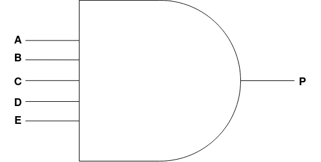
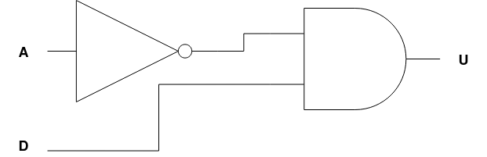

# 2. Definir e Representar Regras de Decisão usando Portas Lógicas

> Seção 2 — Atividade Integradora FIAP — Módulo de Gerenciamento de Pouso e Estabilização de Base (MGPEB)
> Missão Aurora Siger

---

## 2.1 Especificação das Variáveis de Decisão

Com base nas regras de organização da fila e restrições de segurança da Missão Aurora Siger, definimos as seguintes entradas binárias para o sistema:

| Variável | Nome | Valor 1 (verdadeiro) | Valor 0 (falso) |
|----------|------|----------------------|-----------------|
| **A** | Combustível Seguro | Nível ≥ 20% | Nível crítico (< 20%) |
| **B** | Clima | Atmosfera estável | Tempestade de poeira |
| **C** | Área de Pouso | Zona de destino (Z1–Z4) livre | Zona obstruída |
| **D** | Sensores | Telemetria íntegra | Falha nos sensores |
| **E** | Dependência | Módulo dependente já pousou | Dependência não atendida |

> **Exemplo de dependência:** o módulo `PWR-DIST-01` (Terminal de Distribuição) depende de `POWER-NUC-01` (Reator Nuclear). Enquanto o reator não estiver em solo, E = 0.

---

## 2.2 Tradução em Expressões Booleanas

Para garantir a segurança máxima da colônia, o sistema MGPEB opera com duas regras principais:

### Regra 1 — Autorização de Pouso Padrão (P)

O pouso só é autorizado se houver combustível seguro **E** o clima estiver bom **E** a área estiver livre **E** os sensores estiverem OK **E** as dependências técnicas forem satisfeitas.

$$P = A \cdot B \cdot C \cdot D \cdot E$$

> Todos os cinco critérios precisam ser verdadeiros simultaneamente (operação AND). Se qualquer um for falso, o pouso é bloqueado.

### Regra 2 — Alerta de Pouso de Emergência (U)

Um módulo entra em regime de urgência se o combustível estiver abaixo de 20% (**NÃO A**) e os sensores estiverem operacionais para uma manobra arriscada.

$$U = \neg A \cdot D$$

> A inversão (NOT) de A indica combustível crítico. Combinada com D=1 (sensores OK), o sistema autoriza manobra de emergência controlada.

---

## 2.3 Representação por Diagramas de Portas Lógicas

### a. Circuito de Autorização de Pouso (P = A·B·C·D·E)

As cinco variáveis são conectadas em série por portas AND. Todas precisam ser **1** para que a saída P seja **1** (pouso autorizado).



```
A ──┐
B ──┤
C ──┤ AND ──► P (Pouso Autorizado)
D ──┤
E ──┘
```

**Leitura do circuito:** As entradas A, B, C, D e E alimentam uma porta AND de cinco entradas. A saída P = 1 somente quando todos os sinais de entrada são 1 simultaneamente.

---

### b. Circuito de Alerta de Emergência (U = ¬A·D)

A variável A é invertida por uma porta NOT antes de entrar na porta AND junto com D.



```
A ──► NOT ──┐
            ├ AND ──► U (Urgência)
D ──────────┘
```

**Leitura do circuito:** A porta NOT inverte o sinal de A (combustível crítico → ¬A = 1). A porta AND combina ¬A com D: se o combustível estiver crítico E os sensores estiverem OK, o sistema aciona o protocolo de urgência.

---

## 2.4 Tabela-Verdade de Validação — Cenários Críticos

Esta tabela demonstra como o MGPEB decide o destino de um módulo como o `PWR-DIST-01` (Terminal de Distribuição), que depende do `POWER-NUC-01`.

| A (Comb.) | B (Clima) | C (A. Pouso) | D (Sens.) | E (Dep.) | Saída P | Resultado Operacional |
|:---------:|:---------:|:------------:|:---------:|:--------:|:-------:|----------------------|
| 1 | 1 | 1 | 1 | 1 | **1** | ✅ Pouso Autorizado |
| 1 | 1 | 1 | 1 | 0 | **0** | ⏳ Adiado: Aguardando Reator Nuclear |
| 0 | 1 | 1 | 1 | 1 | **0** | ⚠️ Urgência: Baixo combustível — priorizar manobra |
| 1 | 0 | 1 | 1 | 1 | **0** | 🚫 Bloqueado: Tempestade em Marte |

### Análise dos Cenários

- **Linha 1:** Condições ideais — todos os critérios atendidos. Pouso liberado.
- **Linha 2:** Tudo OK, mas o reator ainda não pousou (E=0). Sistema mantém o módulo na fila de espera até que a dependência seja satisfeita.
- **Linha 3:** Combustível crítico (A=0) ativa a Regra 2 (U = ¬A·D = 1). O módulo entra em fila de urgência com protocolo de manobra controlada.
- **Linha 4:** Tempestade de poeira marciana (B=0). Pouso suspenso automaticamente por risco atmosférico.

---

## 2.5 Integração com as Estruturas de Dados do MGPEB

As saídas das expressões booleanas determinam diretamente o status dos módulos nas estruturas lineares do sistema:

| Saída Booleana | Status do Módulo | Estrutura de Dados |
|----------------|-----------------|---------------------|
| P = 1 | `autorizado` | Move da Fila (Queue) → Lista de Pousados |
| P = 0 e U = 0 | `bloqueado` | Permanece na Fila ou vai para Lista de Espera |
| U = 1 | `alerta` | Move para Pilha de Alerta (Stack) — LIFO |
| A < 20% e D = 0 | `crítico` | Topo da Pilha — atendido primeiro |

> A estrutura **Stack (LIFO)** para módulos em alerta garante que o último módulo a entrar em situação crítica seja o primeiro a receber atenção — comportamento adequado para emergências encadeadas.

---

## Referências

1. FLOYD, Thomas L. *Sistemas Digitais: Fundamentos e Aplicações*. 11ª ed. Porto Alegre: Bookman, 2016.
2. TOCCI, Ronald J.; WIDMER, Neal S.; MOSS, Gregory L. *Sistemas Digitais: Princípios e Aplicações*. 12ª ed. São Paulo: Pearson, 2019.
3. Documentação da Missão Aurora Siger — MGPEB: `01-cenario-pouso-fila-modulos.md`
